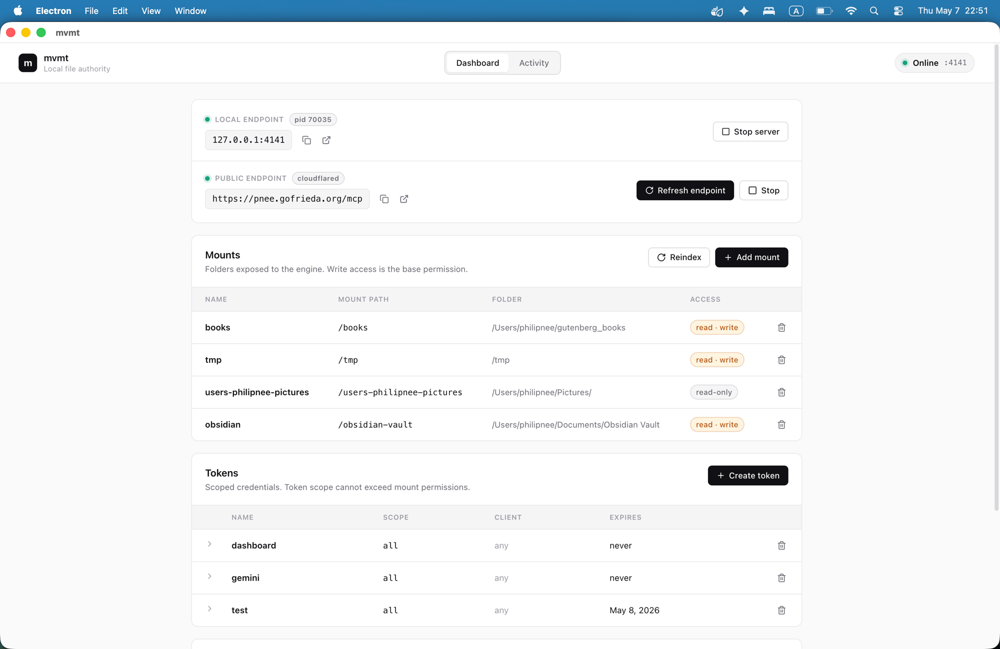

# mvmt-desktop

Desktop control surface for [mvmt](https://github.com/philipnee/mvmt) — a local file authority that exposes folders on your machine to AI agents over MCP.

The CLI does everything; this app just makes it easier to see what's running, what's mounted, who has access, and how to expose it to the outside world.



## What it does

- **Start / stop the local engine** — wraps `mvmt serve` so you can see `pid`, port, and status without a terminal.
- **Manage mounts** — add and remove folders the engine exposes, set read-only vs read+write.
- **Manage tokens** — scoped credentials for clients (Claude, Gemini, etc.). Inline edit permissions, rotate, revoke.
- **Public endpoint via cloudflared** — start, stop, and refresh a tunnel so an MCP client outside your laptop can reach the engine.
- **Activity log** — live tail of what each client is doing against your files.

## Requirements

- macOS (the build is currently `darwin-arm64` only; Windows/Linux targets exist in `electron-builder` config but aren't tested).
- The mvmt engine vendored locally. The build script grabs it from `../mvmt` (or `MVMT_SOURCE_DIR`) and bundles it into the app.
- `cloudflared` if you want a public endpoint. Quick Tunnel works out of the box; named tunnel needs your own setup (below).

## Install / run from source

```bash
git clone git@github.com:philipnee/mvmt-desktop.git
cd mvmt-desktop
npm install

# Vendor the engine + cloudflared into ./vendor (one-time, or whenever the engine changes)
npm run vendor

# Dev
npm run dev

# Build a packaged .app / .dmg
npm run dist:mac
```

The `vendor` step expects the [mvmt](https://github.com/philipnee/mvmt) repo at `../mvmt`. Override with `MVMT_SOURCE_DIR=/path/to/mvmt npm run vendor`.

## Tunnel: public endpoint

The desktop app starts and stops a tunnel; it does **not** configure one. Run `mvmt tunnel config` once in a terminal to pick a provider, then drive it from the UI.

### Default: Cloudflare Quick Tunnel

If you don't bring your own setup, you get a Cloudflare Quick Tunnel — a temporary `*.trycloudflare.com` URL that changes every time the tunnel restarts. Fine for testing; bad if you want a stable address an agent can keep using.

```bash
brew install cloudflared
mvmt tunnel config
# choose: Cloudflare Quick Tunnel
```

That's it. Hit **Start** in the desktop app's tunnel card and a public URL appears.

### Bring your own: Cloudflare Named Tunnel

If you have a domain on Cloudflare and want a stable URL (e.g. `https://mvmt.yourdomain.com/mcp`), set up a named tunnel first, then point mvmt at it.

1. Authenticate cloudflared with your account:
   ```bash
   cloudflared tunnel login
   ```
2. Create a tunnel and route a hostname to it:
   ```bash
   cloudflared tunnel create mvmt
   cloudflared tunnel route dns mvmt mvmt.yourdomain.com
   ```
3. Write a `~/.cloudflared/config.yml` that maps the hostname to your local mvmt port (default `4141`):
   ```yaml
   tunnel: mvmt
   credentials-file: /Users/you/.cloudflared/<tunnel-uuid>.json
   ingress:
     - hostname: mvmt.yourdomain.com
       service: http://localhost:4141
     - service: http_status:404
   ```
4. Tell mvmt to use the named tunnel:
   ```bash
   mvmt tunnel config
   # choose: Cloudflare Named Tunnel
   # cloudflared config file: ~/.cloudflared/config.yml
   # public base URL: https://mvmt.yourdomain.com
   ```

Now the desktop's **Start** button runs your named tunnel and the public endpoint stays the same across restarts.

### Other providers

`mvmt tunnel config` also offers `localhost.run` and a `custom` option (any command that exposes `{port}`). The desktop app drives any of them with the same Start / Stop / Refresh controls.

## Architecture (one paragraph)

Electron main process spawns the vendored mvmt CLI as a child for `serve`, and shells out for everything else (mounts, tokens, tunnel). The renderer is a single React tree that polls the main process over IPC every few seconds for status. There is no separate API layer — the engine's CLI is the API. If a feature exists in the desktop app, it exists in `mvmt --help`.

## License

MIT.
